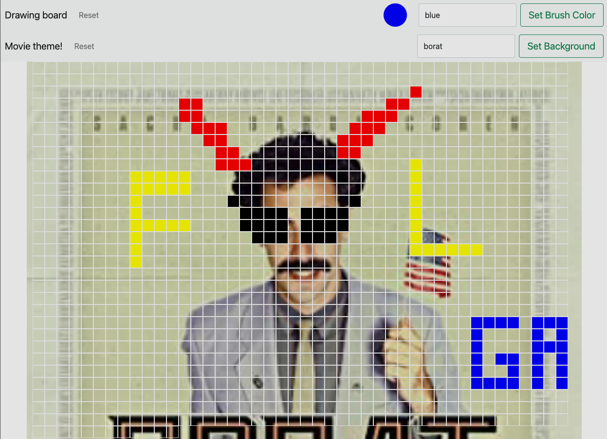

# PaintMe
## OMDBI API / DOM manipulation simple app - <a href="https://sirvand.github.io/PaintMe/"> Live Demo </a>
### user can select a movie/show as background fetching by OMDB api using Axios, a simple paint app  with drawboard - created by Javascript DOM manipulators, Axios for fetching OMDB API JSON file, html and bootstrap 5 for CSS 

### ScreenShot

